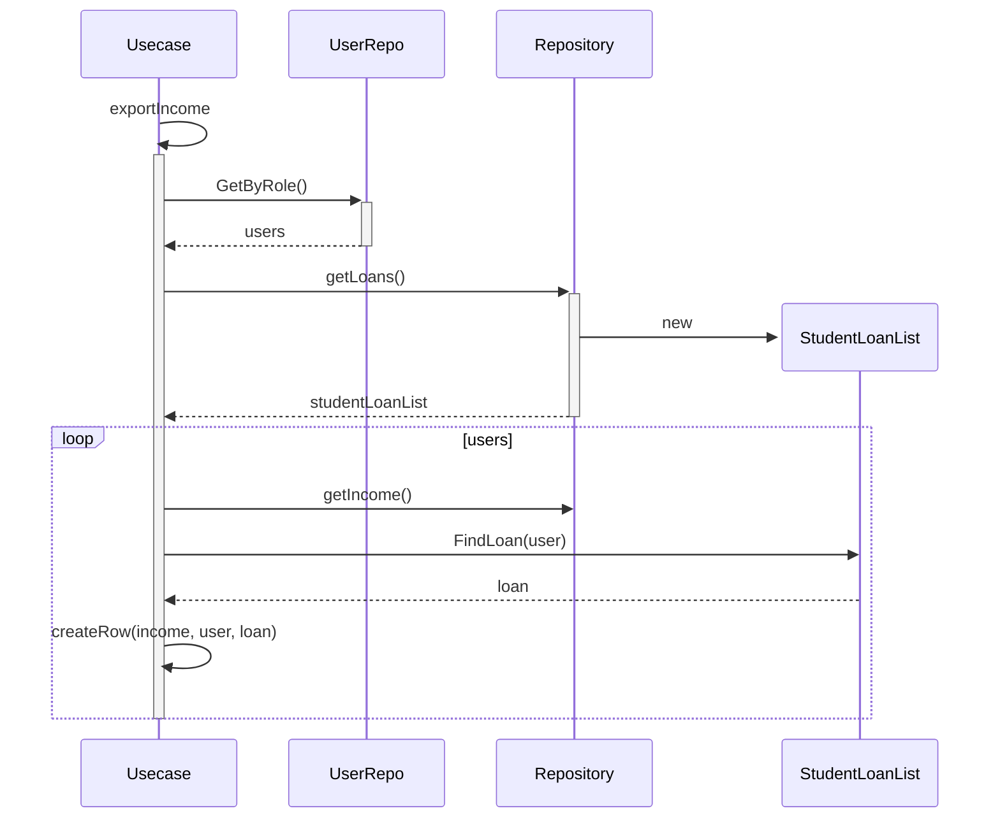

```mermaid
sequenceDiagram
Usecase->>+Usecase: exportIncome
Usecase->>+UserRepo: GetByRole()
UserRepo-->>-Usecase: users
Usecase->>+Repository: getLoans()
create participant StudentLoanList
Repository->>StudentLoanList: new
Repository-->>-Usecase: studentLoanList
loop users
Usecase->>Repository: getIncome()
Usecase->>StudentLoanList: FindLoan(user)
StudentLoanList-->>Usecase: loan
Usecase->>Usecase: createRow(income, user, loan)
end
deactivate Usecase
```