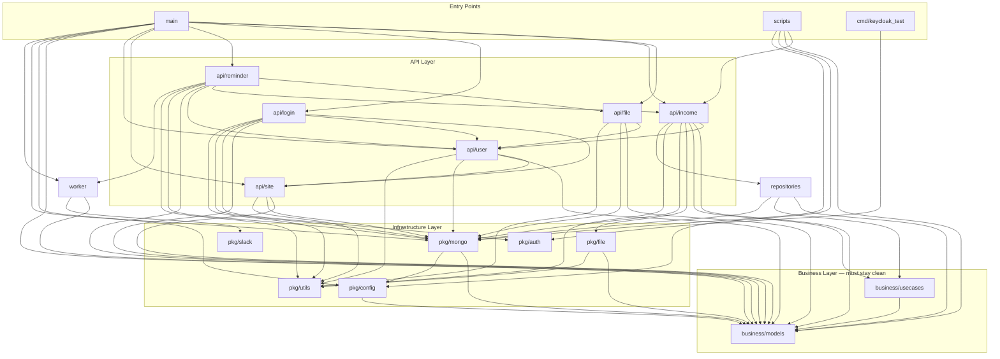

# ADR 0001: Clean Architecture Dependency Rule

## Status

Accepted

## Context

The project is structured in layers:

- **`business/`** — domain models (`business/models`) and application use cases (`business/usecases`). This is the core of the system.
- **`api/`** — HTTP handlers and API-specific logic (`api/file`, `api/income`, `api/login`, `api/reminder`, `api/site`, `api/user`).
- **`pkg/`** — infrastructure concerns: database sessions (`pkg/mongo`), authentication (`pkg/auth`), configuration (`pkg/config`), file export (`pkg/file`), messaging (`pkg/slack`), and shared utilities (`pkg/utils`).
- **`repositories/`** — data access implementations.
- **`worker/`** — background job processing.

Without an explicit rule about dependency direction, business logic risks becoming coupled to infrastructure details (database drivers, HTTP frameworks, third-party services), making it harder to test, reuse, and evolve independently.

## Decision

We follow the **Dependency Rule** from Clean Architecture:

> Source code dependencies must only point inward. Nothing in an inner circle can know anything about something in an outer circle.

Concretely for this project:

1. **`business/models`** must have **zero** imports from other internal packages. It defines the domain entities shared across layers.
2. **`business/usecases`** may only import **`business/models`**. When a use case needs to interact with infrastructure (e.g. persist data, send notifications), it must define an interface (driven port) within `business/usecases` that outer layers implement.
3. **Outer layers** (`api/*`, `pkg/*`, `repositories`, `worker`) may depend on `business/*` but never the reverse.

The driven ports pattern is already in use — see `business/usecases/*_driven_ports.go` and `business/usecases/*_driving_ports.go`.

### Current package dependency flow

### Current compliance

| Package | Internal imports | Clean? |
|---------|-----------------|--------|
| `business/models` | *(none)* | Yes |
| `business/usecases` | `business/models` only | Yes |

Both business packages comply with the Dependency Rule today.

## Consequences

### Positive

- **Testability** — business logic can be unit-tested with simple in-memory fakes; no database or HTTP server required.
- **Portability** — use cases are framework-independent and can be reused if the delivery mechanism changes (e.g. gRPC, CLI).
- **Clarity** — the dependency diagram makes coupling visible; violations are easy to spot in code review.

### Negative

- **Indirection** — use cases that need infrastructure must define driven-port interfaces, adding a layer of abstraction.
- **Discipline** — developers must resist the convenience of importing infrastructure packages directly from business code.
