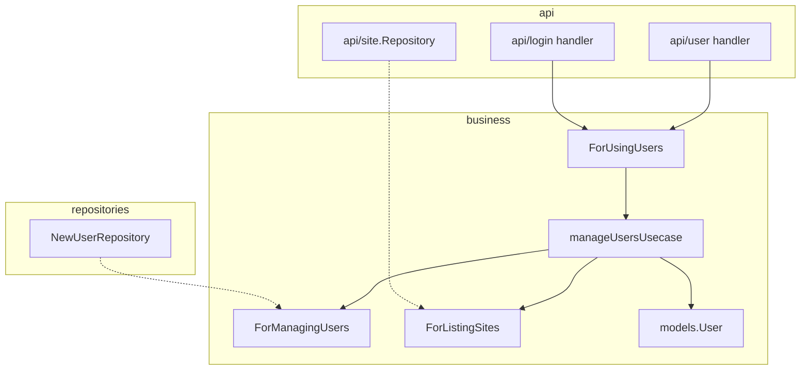

# ADR 0002: Move User Management Use Case into `business/usecases`

## Status

Accepted

## Context

[ADR 0001](0001-clean-architecture-dependency-rule.md) requires application logic to live in `business/usecases`, which may depend only on `business/models`. Outer layers (`api/*`, `repositories`, `pkg/*`) implement driven ports.

`api/income` already followed that shape: the HTTP handler is a thin adapter that composes use cases from `business/usecases` and repositories from `repositories/`.

`api/user` did not. Create, list, update, delete, Tavi status, profile-field merging, and update authorization all lived in `api/user/usecase.go`, which imported `pkg/utils` and `api/site`. That meant:

- User rules could not be reused without pulling in HTTP/Mongo packages (login already depended on `user.NewUsecase`).
- Tests for profile ACL and bank-account sanitization sat next to Echo handlers instead of the domain.
- The dependency rule was applied inconsistently: income was “clean,” user was a classic three-layer package inside `api/`.

Admin editing another user’s profile made this worse: update authorization (self vs admin vs user-admin site-only) is a business rule, not an HTTP concern.

## Decision

User management follows the same ports-and-adapters layout as income.

### Driving port

`business/usecases.ForUsingUsers` is what HTTP (and login) call: Create, Get, GetByID, GetByEmail, GetByRole, GetBySiteID, Update, Delete, UpdateStatusTavi.

### Driven ports

- `ForManagingUsers` — persist users (implemented by `repositories.NewUserRepository`).
- `ForListingSites` — already defined for income export; reused to attach `Site` when listing users.

### Implementation

- `business/usecases/manage_users.go` holds the use case.
- Profile merge rules (digit-only bank account, first-upper names) live on `models.User.ApplyProfileUpdate`, so `business/usecases` still imports only `business/models`.
- Domain sentinels used by the use case (`ErrConflict`, `ErrPermissionDenied`, `ErrInvalidFormat`, plus existing role/VAT errors) live in `business/models`.
- `api/user` keeps the Echo handler. Persistence is `repositories.NewUserRepository`. `NewHttpHandler` wires `usecases.NewManageUsersUsecase(userRepo, siteRepo)`.
- `api/login` composes the same use case instead of `user.NewUsecase`.
- `api/user.Usecase` remains a type alias of `ForUsingUsers` so existing mocks keep compiling.

HTTP adapters still enforce transport-level checks (for example `IsUserManager()` on create/list/delete). The use case owns resource-level rules on Update: self may edit their profile, admin may edit anyone, user-admin updating someone else may change only `SiteID`.

## Consequences

### Positive

- User rules are testable without Echo or Mongo; `manage_users_test.go` sits with the other use cases.
- Login and the users API share one composition root (`NewManageUsersUsecase`).
- `api/user` matches `api/income`: HTTP adapter only; persistence lives in `repositories/`.
- ADR 0001’s dependency rule now holds for user management: `business/usecases` does not import `api/` or `pkg/`.

### Negative

- `api/site` still has its repository under `api/`. This ADR does not migrate it.
- `api/file` still has a use case inside `api/`. This ADR does not migrate it.
- Domain errors now exist both as `models.Err*` (use case) and `utils.Err*` (HTTP helpers). Handlers that branch on identity must use the models sentinel (for example `models.ErrConflict` on login, `models.ErrPermissionDenied` on update).

### Follow-up

When touching `api/site` or `api/file` next, move their use cases the same way rather than growing logic in `api/`.
