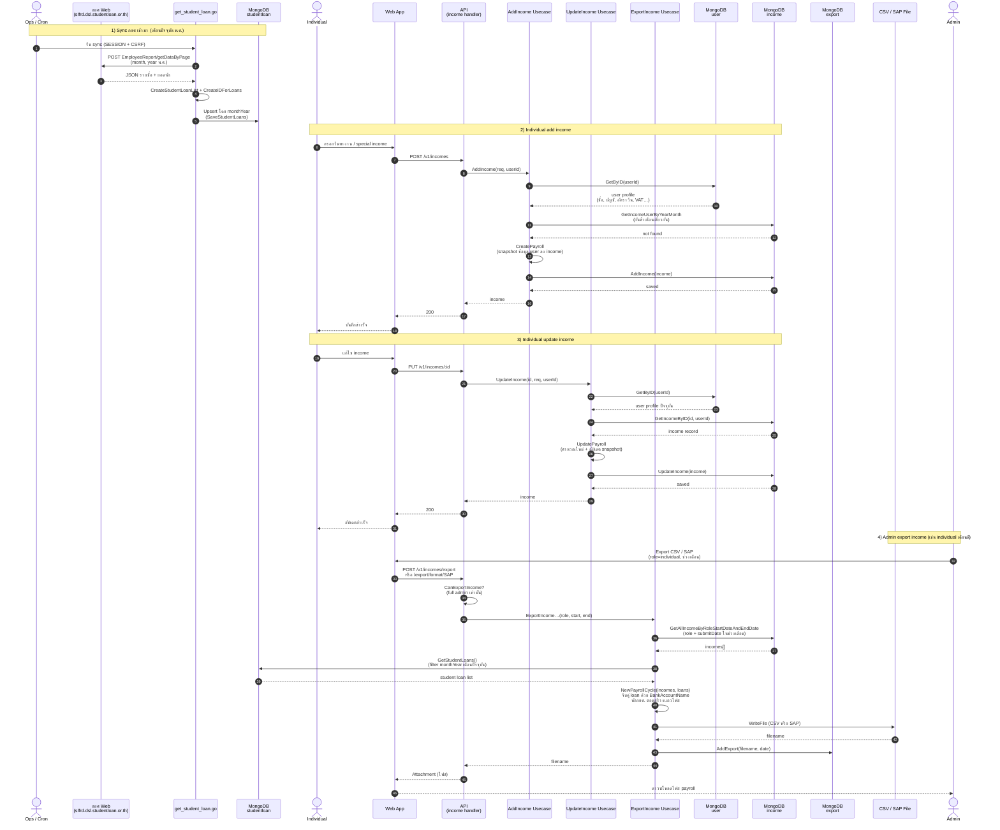

# Income monthly flow

Sequence ของ 1 เดือน: sync กยศ. → individual add/update income → admin export income

## Data sources on export

| Source | Mongo collection | Role |
|--------|------------------|------|
| Income records (primary) | `income` | Filtered by `role` + `submitDate` range; user fields are snapshotted at add/update |
| Student loan deduction | `studentloan` | Matched to income by `BankAccountName` / borrower name |
| Export audit log | `export` | Filename + date after successful export (not input data) |

Export does **not** re-read the live `user` collection.

## Sequence (one month)

## Notes

- กยศ. sync เข้า Mongo **แยกจาก** add income — ไม่ถูกผูกตอน individual กรอก
- Add/Update อ่าน `user` แล้ว **snapshot** ลง `income`
- Export อ่านแค่ `income` + `studentloan`
- Sync script: `scripts/get_student_loan.go` (แหล่งภายนอก `slfrd.dsl.studentloan.or.th`)
- Export usecase: `business/usecases/export_income.go`
