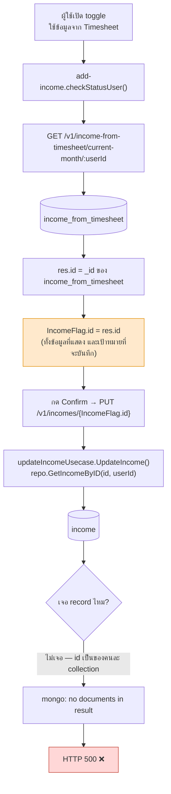
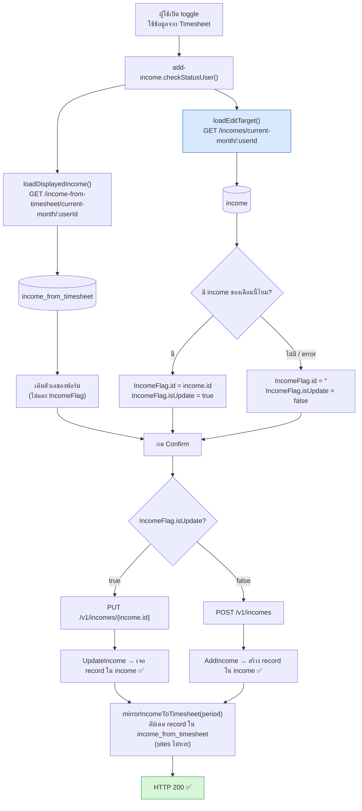

# แก้บั๊ก: เปิด toggle "ใช้ข้อมูลจาก Timesheet" แล้วแก้ไข income ไม่ได้ (500)

## อาการ

เปิด toggle บนหน้า individual แล้วกดแก้ไข income → `PUT /v1/incomes/{id}` ตอบ
`500 {"message":"mongo: no documents in result"}`

## Root cause

`_id` ของ collection `income` กับ `income_from_timesheet` **ไม่เคยตรงกัน** — แม้แต่ record ที่
`mirrorIncomeToTimesheet` เขียน mirror ไว้ ก็ตั้งใจไม่ copy id มา (ดูคอมเมนต์ใน
`business/usecases/mirror_income_to_timesheet.go`)

พอเปิด toggle หน้าเว็บอ่าน record จาก `/v1/income-from-timesheet/current-month/:id` แล้วเก็บ
`res.id` ลง `IncomeFlag.id` ซึ่งเป็น id ของ **อีก collection** — แต่ตอนบันทึกยังยิง
`PUT /v1/incomes/{IncomeFlag.id}` ที่ไปหาใน collection `income` เสมอ จึงหาไม่เจอทุกครั้ง

## Flow เดิม (พัง)

## Flow ใหม่ (แก้แล้ว)

แยก **แหล่งข้อมูลที่แสดง** ออกจาก **record ที่จะบันทึก** — toggle คุมแค่ตัวเลขที่โชว์
ส่วนฟอร์มเขียนลง collection `income` เสมอ (ตรงกับแผน dual-write เดิม ที่ `income` เป็น
source of truth และ `income_from_timesheet` เป็น mirror)

เคสที่เป็นไปได้ทั้งหมดเมื่อเปิด toggle:

| มี record ใน income_from_timesheet | มี record ใน income | ฟอร์มแสดง | กดบันทึกแล้ว |
|---|---|---|---|
| มี | มี | ตัวเลขจาก timesheet | `PUT /incomes/{income.id}` → 200 |
| มี | ไม่มี | ตัวเลขจาก timesheet | `POST /incomes` → 200 แล้ว mirror ทับ record timesheet ของ period นั้น |
| ไม่มี | มี | ฟอร์มเปล่า | `PUT /incomes/{income.id}` → 200 |
| ไม่มี | ไม่มี | ฟอร์มเปล่า | `POST /incomes` → 200 |

## สิ่งที่แก้

**web.odds-worklog**
- `src/app/shared/components/add-income/add-income.component.ts` — แยก `loadDisplayedIncome()` /
  `loadEditTarget()` และให้ `setEditTarget()` เป็นที่เดียวที่เขียน `IncomeFlag.id` / `isUpdate`
  (เดิม `isUpdate` ไม่เคยถูก set ตอนโหลดหน้า อาศัยค่า static default `true` เอา)
- `add-income.component.spec.ts` — เพิ่มเทสต์ครอบ 4 เคสข้างบน

**api.odds-worklog** (defense in depth — ให้ error อ่านออก ไม่ใช่ 500 ลอย ๆ)
- `business/usecases/update_income.go` — เพิ่ม `ErrIncomeNotFound`
- `repositories/income.go` — map `mongo.ErrNoDocuments` → `ErrIncomeNotFound`
- `api/income/handler.go` — ตอบ **404** แทน 500 เมื่อไม่เจอ record
- `docs/openapi.yaml` — ประกาศ response 404 ของ `PUT /v1/incomes/{id}`

## ยังเหลือ (ตาม release note 2026-09-06)

พอ migrate ข้อมูลเข้า `income` ครบและเอา toggle ออก `loadEditTarget()` จะไม่จำเป็นอีก —
`loadDisplayedIncome()` จะกลับไปอ่าน `income` ทางเดียวเหมือนเดิม
