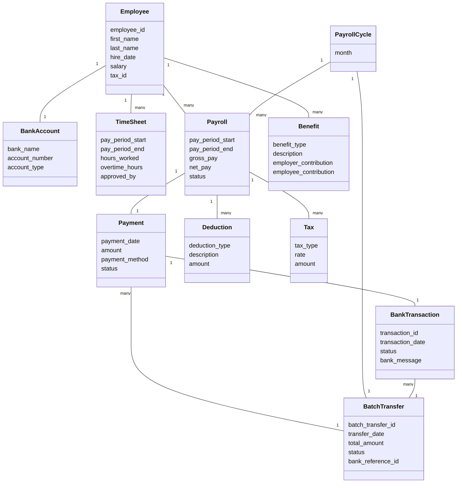
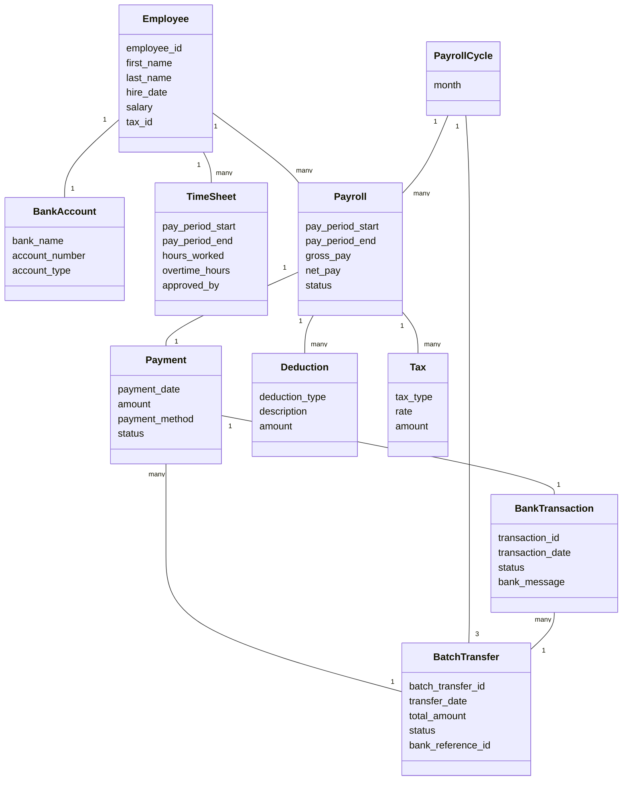
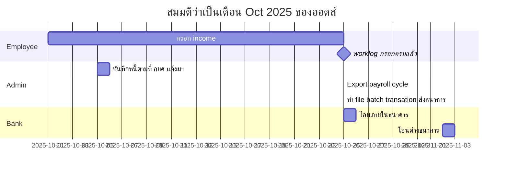

# Analysis model

Analysis model ต่างกับ design model คือมันจะไม่ได้สะท้อนสิ่งที่อยู่ในซอฟต์แวร์ของเรา แต่จะสะท้อน
mental model ในหัว user เป็นหลัก

## Domain Payroll ทั่วไป

ใน domain ของ Payroll ทั่ว ๆ ไป model ที่ chatGPT generate มาให้ หน้าตาประมาณนี้

พนักงาน 1 คน จะมี timesheet ได้หลายใบ (เช่นเดือนละใบ) แต่ละเดือน พนักงานก็จะได้รับค่าจ้าง
(Payroll) ของเดือนนั้น ๆ และอาจจะมีสวัสดิการ

ค่าจ้าง (Payroll) 1 อันจะมี การหักลบหนี้ (Deduction) และภาษีที่ (Tax) เกิดขึ้นจากรายได้ครั้งนั้น
เช่น

- ภาษีมูลค่าเพิ่ม (Value Added Tax, VAT) หรือ
- ภาษีหัก ณ ที่จ่าย (Witholding Tax) เป็นต้น

Payroll ของพนักงานทุกคนในเดือนนั้น ๆ จะถูกเอาไปรวมกันเป็น PayrollCycle ของเดือนนั้น ๆ
แล้วตอนทำจ่าย ก็ไปทำ BatchTransfer ที่ธนาคารเพื่อส่งรายการว่าต้องโอนให้บัญชี BankAccount ไหน
ยอดเท่าไหร่บ้าง เกิดเป็น BankTransaction สำหรับแต่ละรายการ ซึ่ง BankTransaction
ที่เกิดขึ้นจะสะท้อน Payment ของเดือนนั้น ๆ ของพนักงานแต่ละคน

## Odds Payroll

เพื่อให้มั่นใจว่าไม่มีใครในออดส์อยู่เพราะเสียดายสวัสดิการ พวกเราเลยไม่มีสวัสดิการ (Benefit)

Deduction หลัก ๆ ที่เรามี คือบางคนที่มีหนี้กองทุนกู้ยืมเพื่อการศึกษา (กยศ) บริษัทจะต้องหักหนี้ กยศ
ออกจากค่าจ้าง ก่อนจ่ายให้กับพนักงาน

ภาษีหัก ณ ที่จ่าย (Withholding Tax) เป็นหน้าที่ของบริษัทต้องหักและนำส่งสรรพากรแทนพนักงาน
ส่วนที่เหลือให้พนักงานไปจ่ายเพิ่ม หรือขอคืนเองตามภาษีเงินได้ประจำปีของพนักงานคนนั้น ๆ

สำหรับบุคคล/นิติบุคคลที่จดทะเบียนภาษีมูลค่าเพิ่ม (VAT) มีภาระที่จะต้องเก็บภาษีมูลค่าเพิ่มจาก Payroll
นี้เพื่อไปนำส่งภาษีมูลค่าเพิ่มต่อไป

แต่ละ PayrollCycle ของเราจะถูกแบ่งจ่ายออกเป็น 3 BatchTransaction คือ

1. สำหรับ Individual user
1. สำหรับ Corporate user (ที่จดนิติบุคคล) และมี BankAccount ของ TTB เอง และ
1. Coporate user ที่ใช้บัญชีต่างธนาคาร

ที่ต้องแยก Corporate ต่างธนาคารออกไป เพราะการโอนภายใน TTB จะ effective ทันที
แต่ถ้าโอนต่างธนาคารจะต้องรอ 2 business days ถึงจะมีผล เลยต้องแยก file BatchTransaction
ออกจากกันเป็นคนละ file

หน้าตา analysis model สำหรับออดส์เลยเป็นแบบนี้ (ไม่มี benefit และ 1 PayrollCycle จะมี 3
BatchTransactions)

## Process ในการได้ file PayrollCycle มา

